# 讲义

[课程简介讲义](https://lizongzhang.github.io/business_stat/intro.html){target="_blank"}
        
        
[Getting Started
        讲义](https://lizongzhang.github.io/business_stat/chapgs.html){target="_blank"}
        
[chap1
        讲义](https://lizongzhang.github.io/business_stat/chap1.html){target="_blank"} 
        
# 本章难点

## GS: Descriptive Statistics & Inferential Statistics

Click to view image

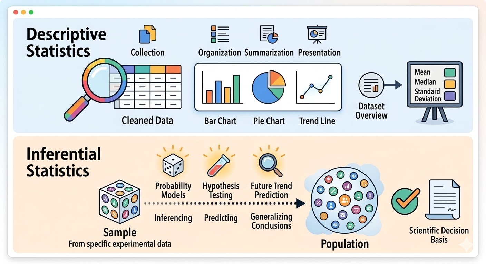
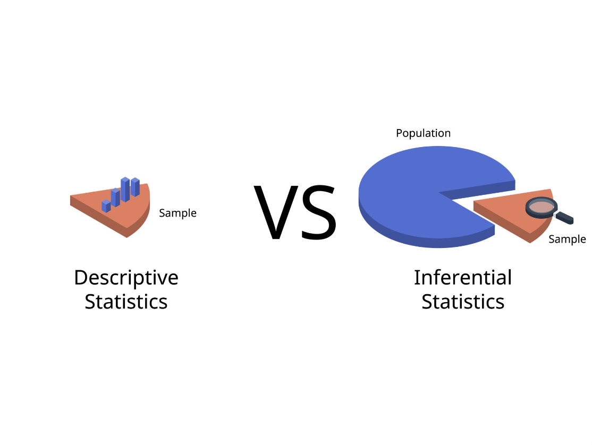
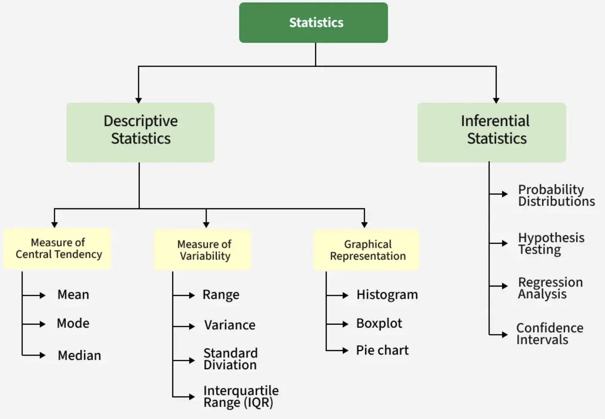
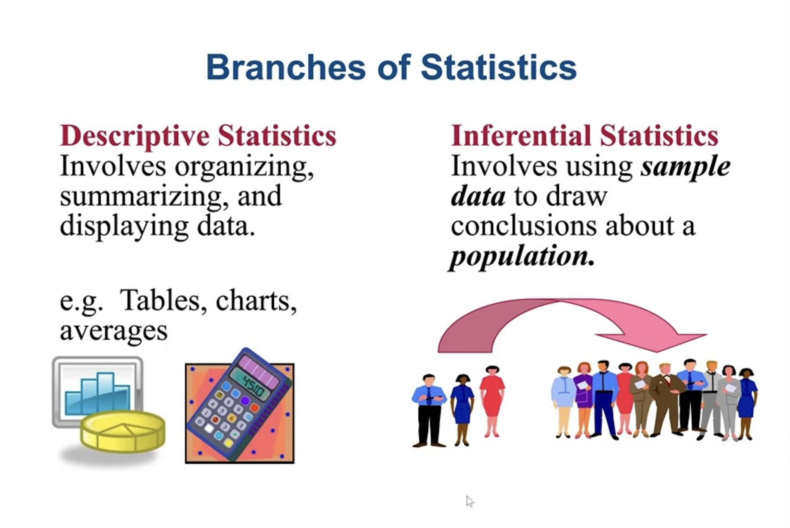

## Classifying Variables by Type

Click to view image

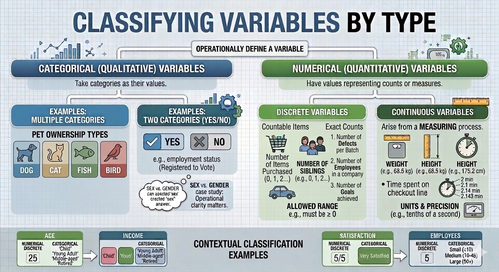

## Population vs Sample

Click to view image

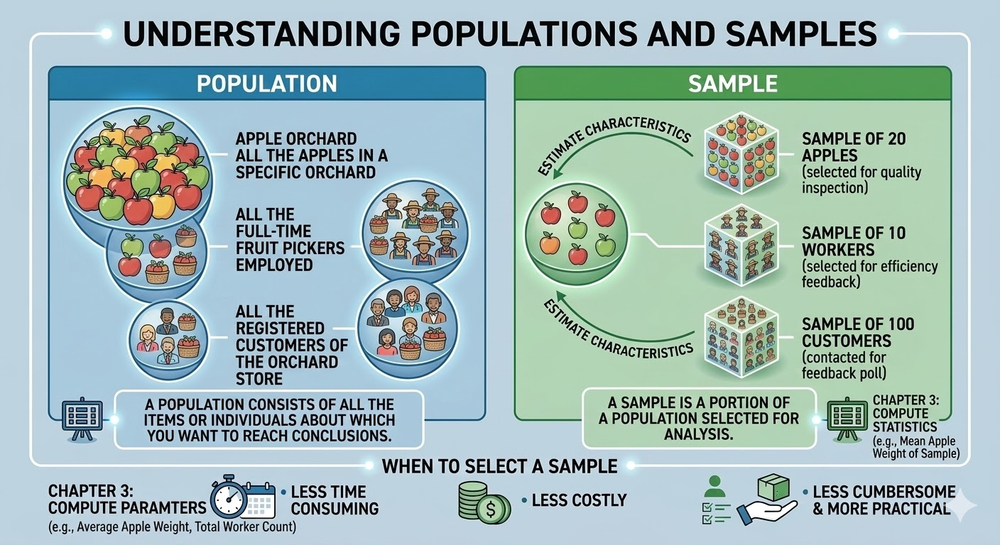

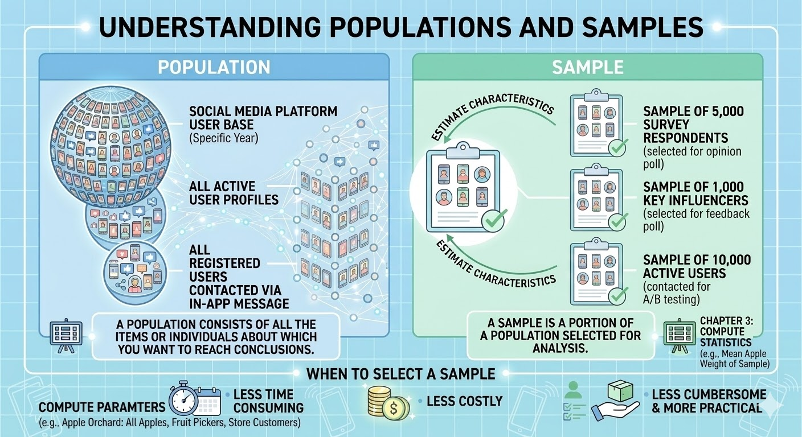

## Types of Sampling Methods

Click to view image

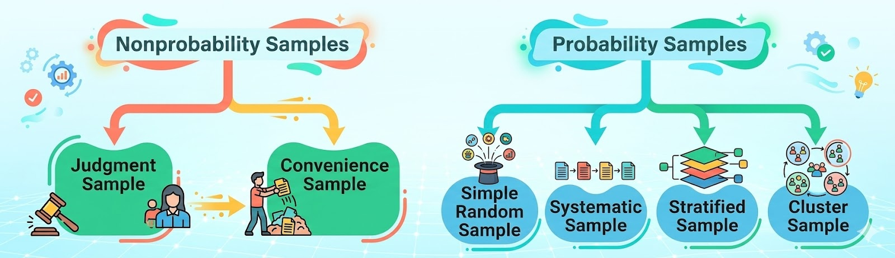

## Types of Survey Errors

Click to view image

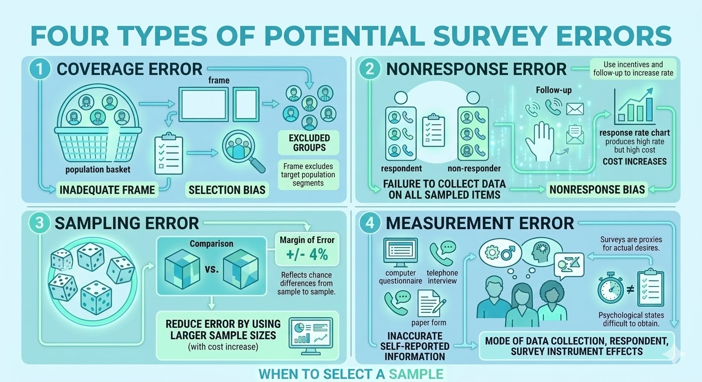

# 课堂练习

## 题目1

### 1.1 浏览下述二手房信息，可以提取二手房的哪些变量？

点击浏览图片

- 房源1：五山花园

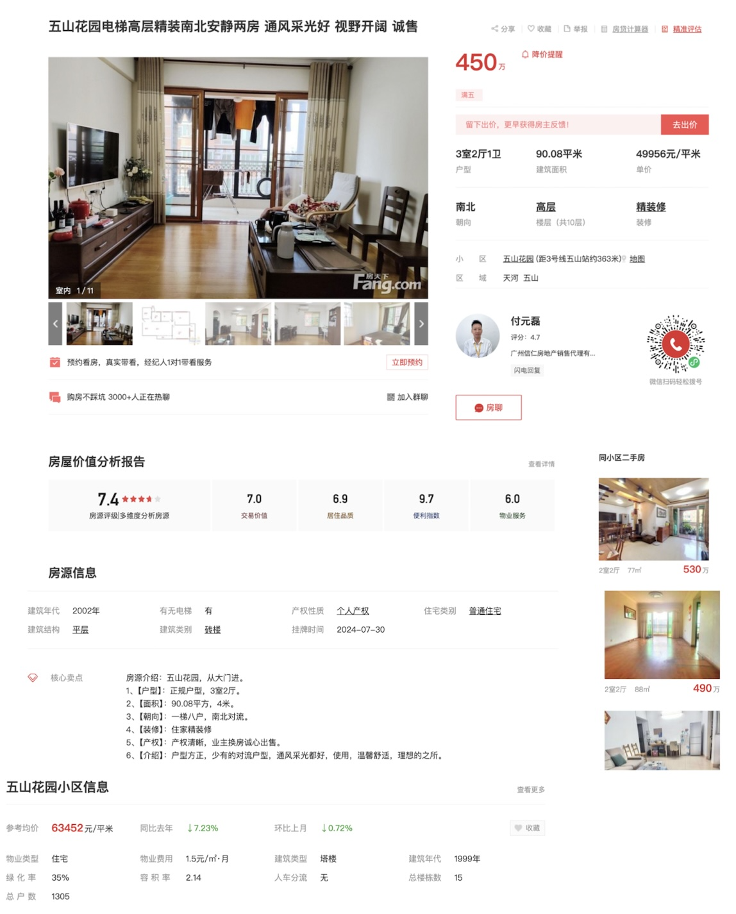

- 房源2：华农嵩山
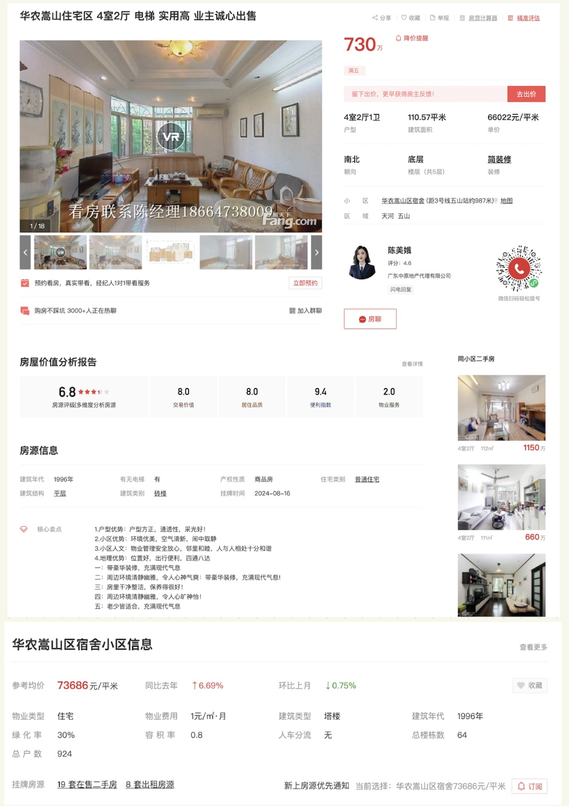

- 房源3：汇景新城
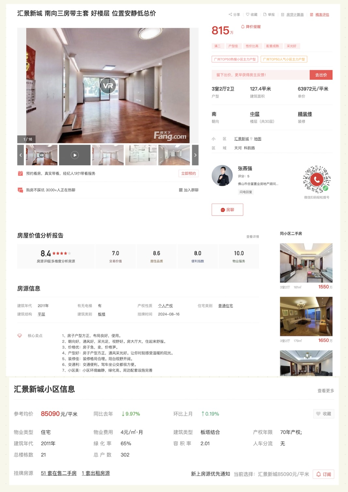

### 1.2 从该网页中提取的变量是分类数据(有序分类还是无序分类), 还是数值数据(离散数据还是连续数据)？

### 1.3 根据上述二手房房源信息，你感兴趣的问题是什么？

## 题目2

### 2.1 开展关于毕业生薪酬的研究，你感兴趣那些问题？列出研究问题。

### 2.2 针对你想研究的的问题，你想收集那些数据？列出变量名称，这些数据是分类数据(有序分类还是无序分类), 还是数值数据(离散数据还是连续数据)？

# 软件工具

[如何加载Excel的“数据分析”加载项](https://www.bilibili.com/video/BV19S4y1r7E4/){target="_blank"}

[不用安装就可以免费使用的网页版Excel](https://www.bilibili.com/video/BV1w6421w7Rf/){target="_blank"}

[如何将WORD文档转成图片？](https://www.bilibili.com/video/BV1GU4y1f7f9/){target="_blank"}

# 拓展资源

经管之家 <https://bbs.pinggu.org/>{target="_blank"} 

狗熊会(微信公众号) <https://www.xiong99.com.cn/>{target="_blank"}

UCLA Data Analysis Examples <https://stats.oarc.ucla.edu/other/dae/>{target="_blank"} 

Learn Excel with Examples <https://www.excel-easy.com/examples.html>{target="_blank"} 

The Data And Story Library <https://dasl.datadescription.com/>{target="_blank"} 

 Kaggle <https://www.kaggle.com/>{target="_blank"} 

CSMAR 国泰安经济金融数据库  <http://www.gtarsc.com/Home>
        
中国家庭追踪调查 CFPS <http://www.isss.pku.edu.cn/cfps/>
    
中国家庭金融调查数据 CHFS  <https://chfs.swufe.edu.cn>
    
中国健康与养老数据追踪调查数据CHARLS <http://charls.pku.edu.cn>
    
暨南大学社会调查中心  <https://sdc-iesr.jnu.edu.cn>
    
# 教学视频

[如何从中国知网下载统计数据？](https://www.bilibili.com/video/BV19m4y1F7FE/)

[八爪鱼客户端抓取网页数据？](https://www.bilibili.com/video/BV18u411D7GM/)

[如何用Excel整理提取的网页数据？](https://www.bilibili.com/video/BV1HL411N7BG/)

# 课堂小调查

**电子产品消费调查：<https://v.wjx.cn/vm/rMN4ASP.aspx#>**

# 测验

- [Quiz: GETTING STARTED: IMPORTANT THINGS TO LEARN FIRST](https://ks.wjx.com/vm/hA8GRBD.aspx# ){target="_blank"}
