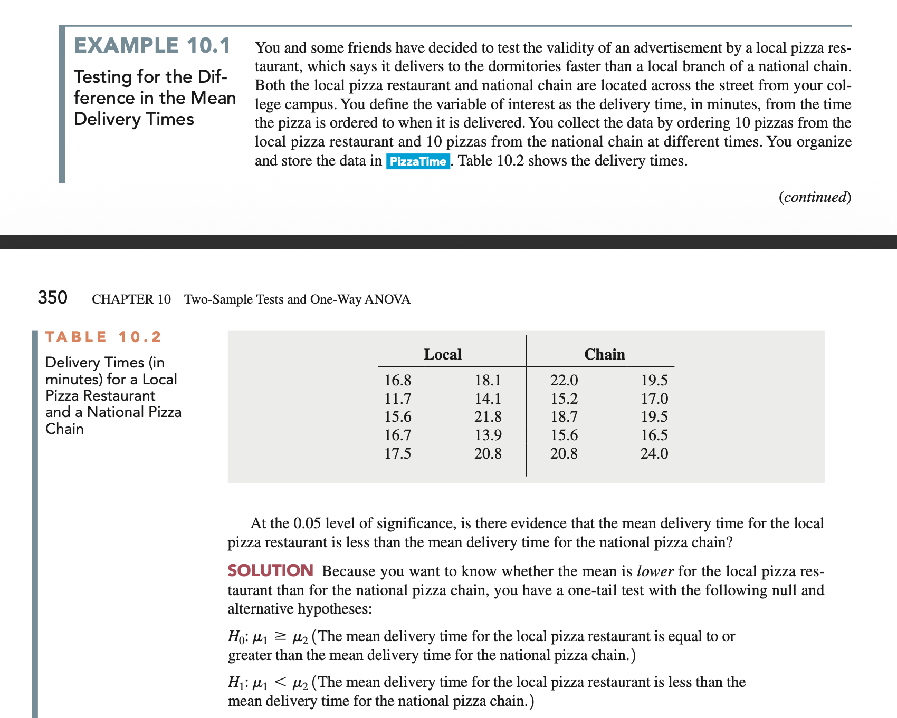
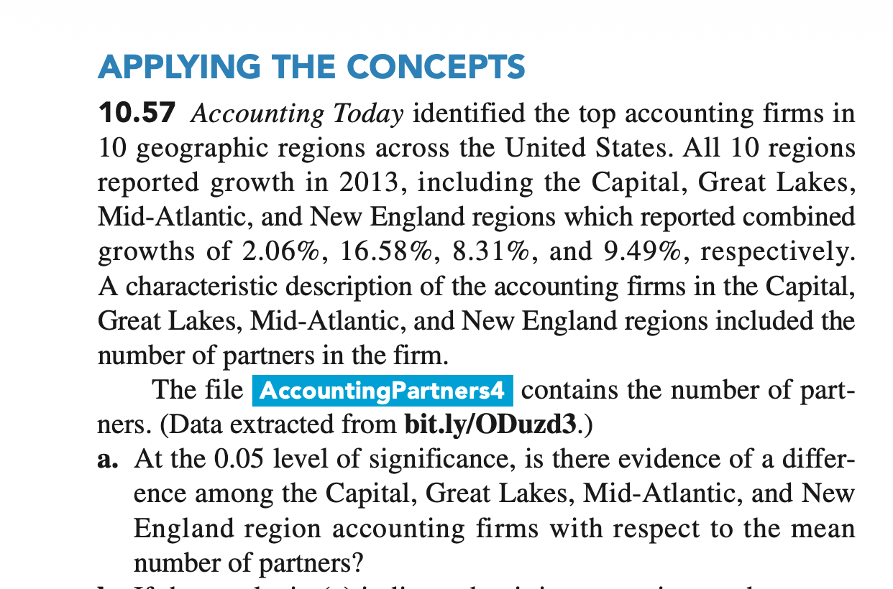
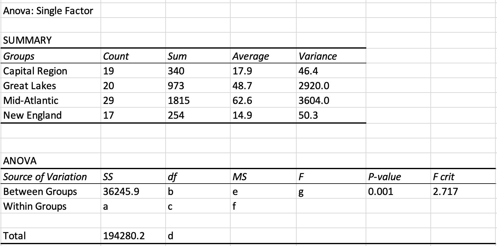
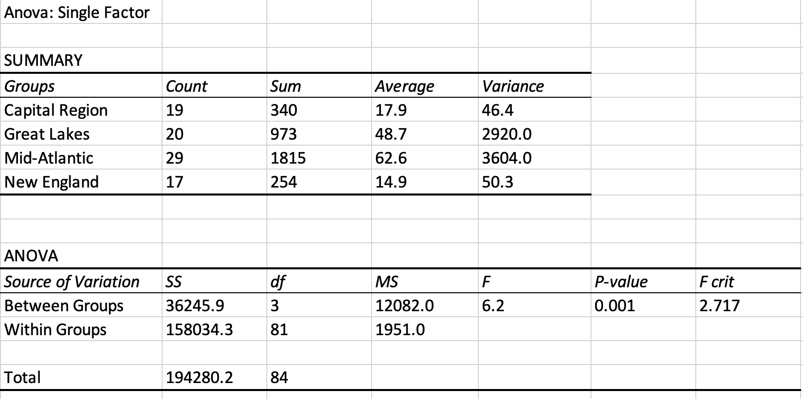

# 10 Two-Sample Tests and One-Way ANOVA

[chap10
        讲义](https://lizongzhang.github.io/business_stat/chap10.html)
        
        
# 课堂练习

## Pooled Variance t-test

Click to view image

P349，Example 10.1

1.Write the null and alternative hypotheses for this test.

2.Report the test statistic and p-value for this test.

3. What is the formula to compute the pooled variance for this test?

4. Is it appropriate to use the pooled variance t-test for this problem? Why or why not? F_0.025(9, 9) = 4.026, F_0.975(9, 9) = 0.248

5. Based on the results of this test, is there sufficient evidence to conclude that the mean delivery time for the local pizza restaurant is less than the mean delivery time for the national pizza chain? 

## One-Way ANOVA

Click to view image

P349，Example 10.1

1.Write the null and alternative hypotheses for this test.

2. Compute the values of items (a) through (g) in the ANOVA summary table.

3. What is the meaning of the p-value of F test?

4. At the 0.05 level of significance, is there evidence of a difference among the Capital, Great Lakes, Mid-Atlantic, and New
england region accounting firms with respect to the mean
number of partners?

        
# 重点难点

  
 
  
  配对样本和独立样本的区别


    

## Excel教学视频

[Excel 两个总体方差比的F检验](https://www.bilibili.com/video/BV1Zr4y1F7jK/)

[Excel 两个总体均值是否相等的T检验](https://www.bilibili.com/video/BV16Z4y137HV/) 
        
[EXCEL 配对样本的T检验](https://www.bilibili.com/video/BV1mD4y1Q77U/) 

[EXCEL 单因素方差分析](https://www.bilibili.com/video/BV1nf4y1v71b/)

## SPSS操作

[两个独立样本t检验](https://www.bilibili.com/video/BV1bi4y1j7Gc/)

[配对样本的t检验](https://www.bilibili.com/video/BV1Fy4y167rs)     

[SPSS 单因素方差分析ANOVA](https://www.bilibili.com/video/BV1M54y1C7EB
)

# 习题答案

 [10.9, 10.12, 10.22, 10.26, 10.30, 10.45, 10.48 ](https://lizongzhang.github.io/business_stat/solution10.html)

# 拓展资源 

方差分析数值演示 <https://www.geogebra.org/m/dTCH4EKG>{target="_blank"}

