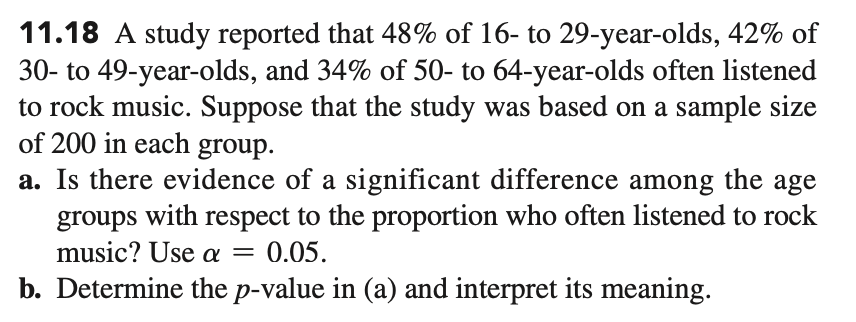

# 11 Chi-Square Tests

[chap11
        讲义](https://lizongzhang.github.io/business_stat/chap11.html)
        
# 课堂练习

Click to view image

P421，Ex 11.18

At the 0.05 significance level, test whether age group and listening to rock music are independent.

1.Write the null and alternative hypotheses for this test.

2.Calculate the expected frequency for this test.

3.Report the chi-square test statistic.

4.What's your conclusion? $\quad \chi^2_{0.05}(2) = 5.991$

# 教学视频 

## Excel操作视频

[EXCEL 独立性检验 CHISQ.TEST函数的使用](https://www.bilibili.com/video/BV19A411x7EU/)

## SPSS操作视频

[SPSS 独立性检验：两个定性变量是否相互独立？](https://www.bilibili.com/video/BV1pD4y1R7KC)

[SPSS 列联表分析应用举例](https://www.bilibili.com/video/BV1Kp4y167vZ)

# 拓展资源

独立性检验计算器 <https://www.standarddeviationcalculator.io/chi-square-calculator>{target="_blank"}

# 复习

[知识点思维导图](https://lizongzhang.github.io/business_stat/review.html){target="_blank"}
