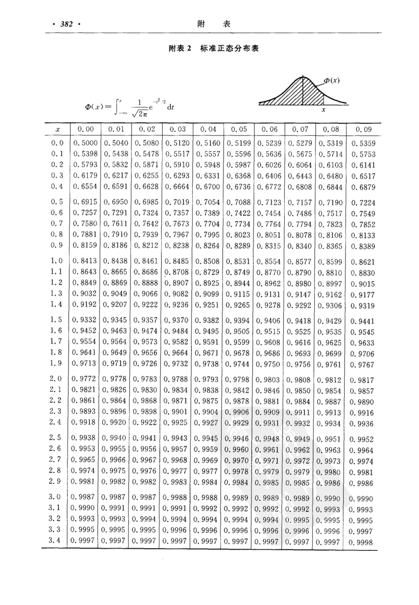

# 6 The Normal Distribution

[chap6
        讲义](https://lizongzhang.github.io/business_stat/chap6.html) 

## 教学视频

[EXCEL利用norm.dist函数绘制正态分布概率密度曲线](https://www.bilibili.com/video/BV1Hi4y1L7Eg/){target="_blank"}

## 绘制标准正态分布表

利用Excel绘制标准正态分布表。

{.lightbox}

[第6题 如何用Excel创建标准正态分布函数表？](https://www.bilibili.com/video/BV1Uv4y1p71t/){target="_blank"}

[ 中心极限定理](https://www.bilibili.com/video/BV1E1421976D/){target="_blank"}

## 拓展资源

正态分布概率密度曲线动画演示 <https://www.geogebra.org/m/nrgtzj5a>{target="_blank"}

